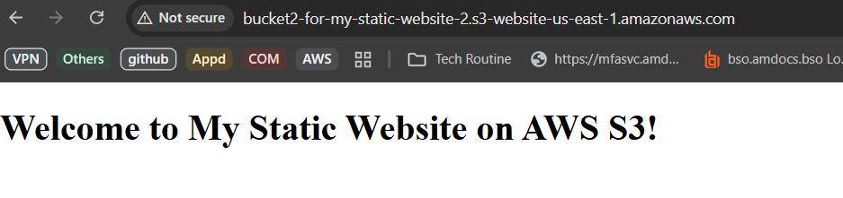

# 1-create-a-static-website-using-amazon-s3

- Very simple project just to get you started with terraform 
- This setup will create a fully functional S3-hosted static website with public access.

- Prerequisites
- Before deploying the static website, ensure you have the following:
    - ✅ Terraform 
    - ✅ AWS Account 
    - ✅ IAM User with Admin Privileges 
    - ✅ AWS Credentials
    - ✅ AWS CLI 
    
- Steps:
    - Create an S3 bucket for hosting.
    - Configure it for static website hosting.
    - Set up bucket policy to allow public read access.
    - Add an index.html file.

- Folder structure
```
terraform-static-site/
│── main.tf              # Main Terraform configuration file
│── variables.tf         # Define variables (optional)
│── outputs.tf           # Define outputs like website URL
│── text/index.html      # Your website's main HTML file
│── terraform.tfvars     # Variable values (optional)
│── README.md            # Project description and setup instructions
```

- Getting started
Clone the repository locally in your system:
```
git clone https://github.com/marvinga/1-create-a-static-website-using-amazon-s3
```

- Deploy the code in your AWS account with Terraform
```
cd 1-create-a-static-website-using-amazon-s3

terraform init
terraform validate
terraform plan
terraform apply
terraform output website_url
terraform destroy
```




- AWS Reference: 
1. Create a Static Website Using Amazon S3 
https://lnkd.in/ggz9MBGD 


